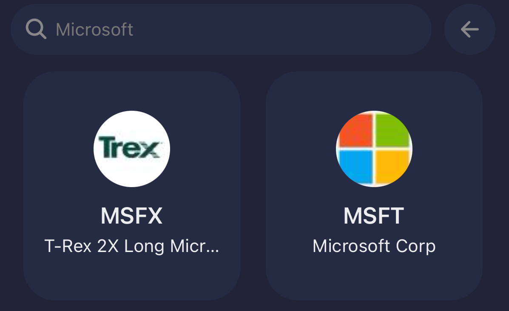
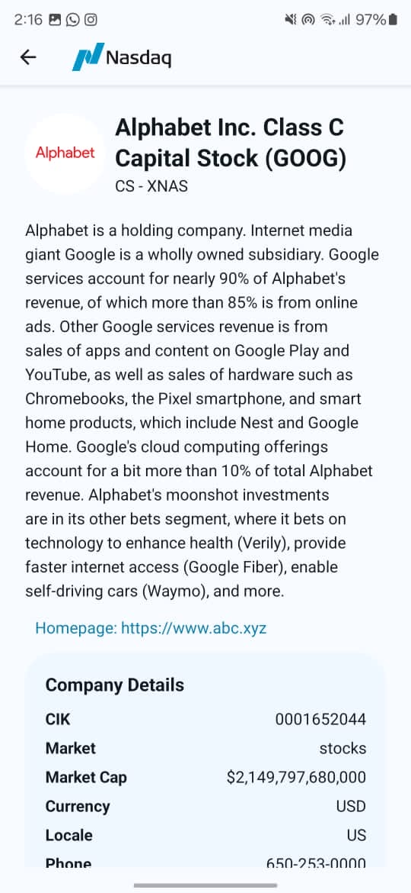
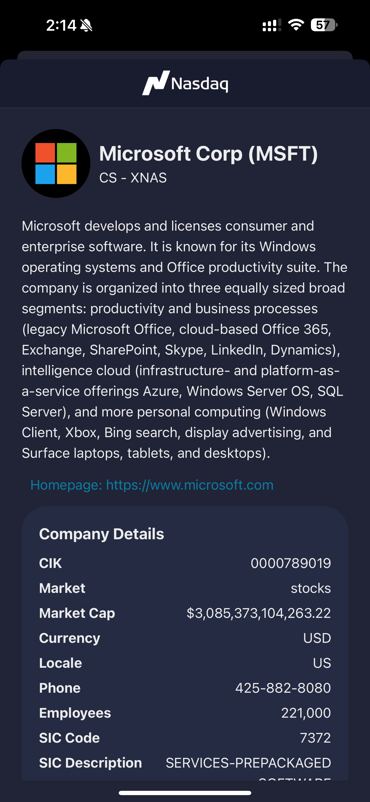
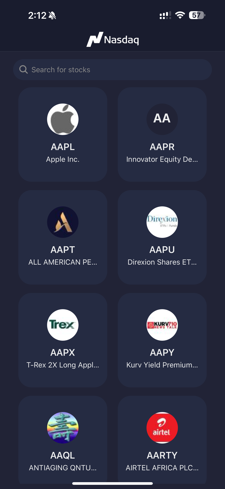
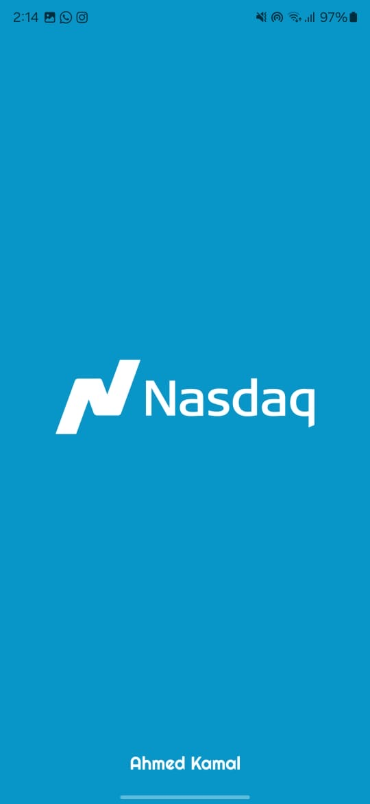

# NasdaqApp 📈📉

Welcome to NasdaqApp, a React Native application designed by Ahmed Kamal for ⚡️, offering seamless access to stock market data and insights. 🚀

## Table of Contents

- [Introduction](#introduction)
- [Features](#features)
- [Skillset Demonstrated](#skillset-demonstrated)
- [Constant File](#constant-file) 🎨
- [Search Bar Component](#search-bar-component) 🔍
- [Themed Container](#themed-container) 🎨
- [Zustand State Management Store](#zustand-state-management-store) 🔄
- [Custom Hook for Data Fetching](#custom-hook-for-data-fetching) ⚙️
- [API Calls](#api-calls) 📡
- [Extra Details Page](#extra-details-page) ℹ️
- [Main Page](#main-page) 🏠

## Introduction

NasdaqApp is a React Native application developed as a task for Thndr Company by Ahmed Kamal. It offers users a convenient platform to explore stock market data with ease. This README provides an overview of the app's features, skillset demonstrated, and key components.

## Features

- **Search Bar Component**: Utilize the search bar to quickly find stocks you're interested in.
  
- **Themed UI**: Enjoy a visually appealing UI with light and dark theme support for a comfortable viewing experience.
  
- **Zustand State Management**: Manage application state seamlessly with Zustand, ensuring responsiveness and efficiency.
  
- **Custom Hook for Data Fetching**: Fetch and manage ticker data using a custom hook, promoting code reusability and modularity.
  
- **API Integration**: Interact with an external API to retrieve stock data and display it within the app.
  
- **Detailed Ticker Information**: Explore comprehensive details about each stock, including company information and addresses.

## Skillset Demonstrated

- **Componentization**: Break down UI components for reusability and maintainability, enhancing the app's scalability.
  
- **Theming**: Implement a theme-based styling approach to provide a consistent look and feel across light and dark modes.
  
- **Error Handling**: Gracefully handle errors with error messages and toast notifications, ensuring a smooth user experience.
  
- **Custom Hooks**: Utilize custom hooks for data fetching to abstract logic and enhance code organization.
  
- **API Integration**: Integrate with an external API to fetch and display stock data within the application.

## Constant File

The constant file contains color schemes for both light and dark themes, ensuring consistent visual aesthetics across the application. 🎨

## Search Bar Component

The Search Bar Component provides users with an intuitive interface for searching stocks. It features dynamic animations and state management to enhance user experience. 🔍

## Themed Container

The Themed Container component ensures consistent theming across the application, adapting to both light and dark modes seamlessly. 🎨

## Zustand State Management Store

Zustand State Management Store efficiently manages application state, including tickers and status, ensuring a smooth and responsive user experience. 🔄

...

## Custom Hook for Data Fetching

The custom hook for data fetching decouples data retrieval logic from component rendering, promoting code reusability and maintainability. ⚙️

...

## API Calls

API calls are handled efficiently with rate limiting , environment variables management and toast messages showing failures (In this case because of too many requests in one minute), ensuring optimal usage and security. 📡 

...

## Extra Details Page

The Extra Details Page allows users to explore comprehensive information about each stock, including company details and addresses, enhancing their understanding and decision-making process. ℹ️

## Main Page

The Main Page of the app features a sleek design and intuitive user interface, integrating search functionality and displaying ticker data efficiently. 🏠

## Splash Screen

The splash screen gives users an initial visual experience of the app, enhancing brand recognition and aesthetic appeal.

## Happy Coding! 🚀

Thank you for exploring NasdaqApp! I hope you enjoy using it as much as I enjoyed creating it! 📈💻
